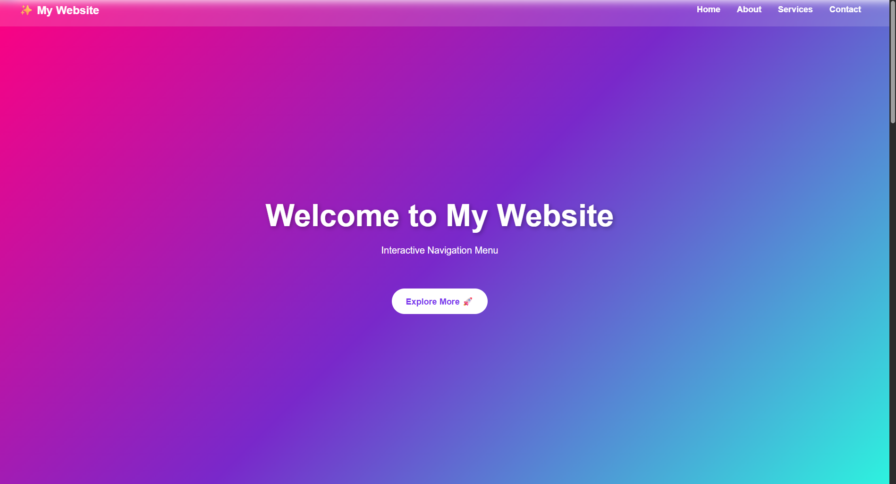
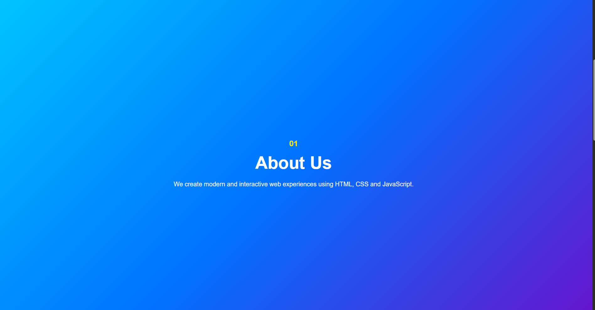
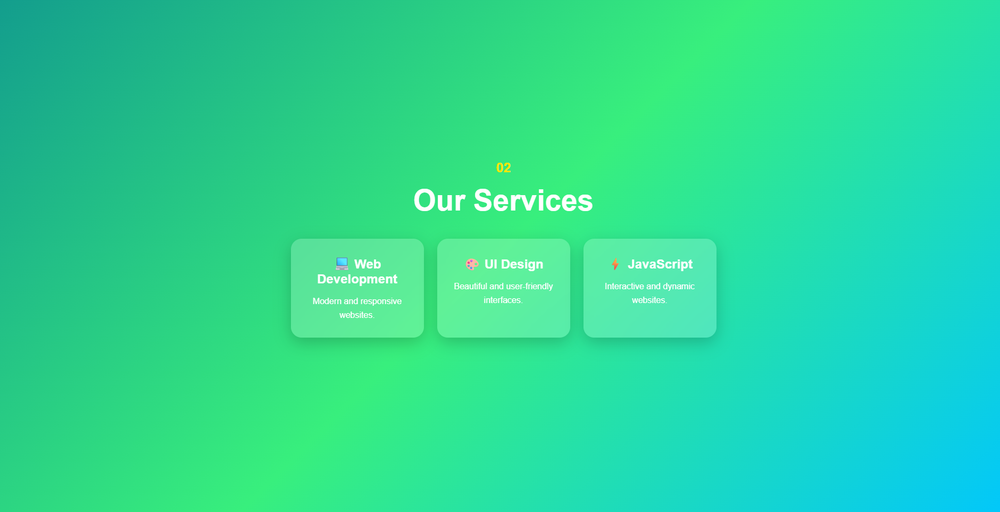

# 🌈 ProDigy Infotech - Task 01

## 📌 Interactive Navigation Menu

This project is created as part of **ProDigy Infotech Web Development Internship - Task 01**.

The project demonstrates an **interactive and colorful navigation menu** using:

- HTML
- CSS
- JavaScript

The navigation bar remains fixed while scrolling and changes its appearance when the user scrolls or hovers over menu items.

---

## 🚀 Live Website

🌐 **Visit My Website:**  
[Click Here to Visit My Website](YOUR_WEBSITE_LINK_HERE)

> Replace `YOUR_WEBSITE_LINK_HERE` with your actual GitHub Pages website link.

---

## ✨ Features

- 📌 Fixed navigation bar
- 🎨 Colorful gradient backgrounds
- 🖱️ Hover effects on navigation links
- 📜 Navigation bar changes style while scrolling
- 🔗 Smooth scrolling between sections
- 💻 Responsive design
- 🎴 Interactive service cards
- 🚀 Attractive buttons
- 📱 Mobile-friendly layout

---

## 🛠️ Technologies Used

| Technology | Purpose |
|------------|---------|
| HTML5 | Website structure |
| CSS3 | Styling and animations |
| JavaScript | Scroll interaction |

## 📂 Project Structure

PRODIGY_TASK_01
│
├── index.html
├── style.css
├── script.js
└── README.md

## 🎯 Task Objective

Create an interactive navigation menu that:

1. Has a fixed position.
2. Remains visible while scrolling.
3. Changes color or style when scrolling.
4. Changes appearance when hovering over menu items.
5. Uses HTML for structure.
6. Uses CSS for styling.
7. Uses JavaScript for interactivity.

## 📸 Project Preview

The website contains:

## 📸 Screenshots

🏠 Home Page

### 👤 About Section

### 💼 Services Section

### 📩 Contact Section

## 👨‍💻 Developed By

**Akshaya**

### Internship

**ProDigy Infotech**

### Task

**Task 01 - Interactive Navigation Menu**
